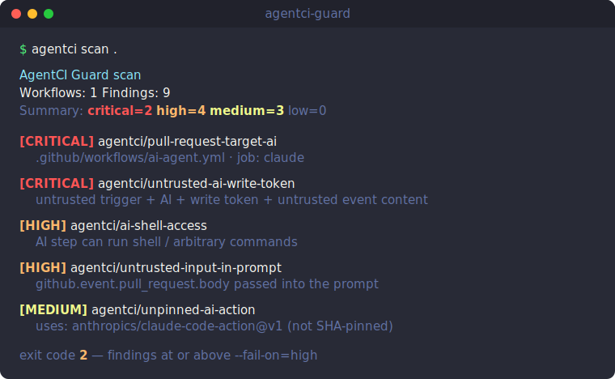

# AgentCI Guard

AgentCI Guard is a CLI and GitHub Action that detects unsafe AI coding-agent usage in CI/CD workflows.

It focuses on one high-risk pattern: untrusted GitHub event content reaching an AI agent that has secrets, write permissions, shell access, or unsafe checkout behavior.



> The animated terminal demo is generated from [`docs/demo.tape`](docs/demo.tape) — run `vhs docs/demo.tape` to produce `docs/demo.gif`.

## What It Detects

- AI-agent usage in `.github/workflows/*.yml`
- `pull_request_target` combined with AI agents
- PR/issue/comment/review/branch/commit content passed into prompts or shell commands
- `contents: write`, `pull-requests: write`, or other broad write scopes near AI usage
- `secrets.*`, `GITHUB_TOKEN`, and token-like environment variables in agent jobs
- shell access combined with AI usage
- unpinned third-party AI actions
- checkout of untrusted PR head code in privileged contexts

## CLI Quickstart

```bash
# Run without installing
npx agentci-guard scan .

# Or install globally
npm install -g agentci-guard

agentci scan .
agentci scan . --json
agentci scan . --sarif agentci-results.sarif
agentci explain agentci/untrusted-ai-write-token
```

Exit codes:

- `0`: no findings at or above `--fail-on`
- `2`: at least one finding at or above `--fail-on`
- `1`: scanner error

Default fail threshold is `high`.

## GitHub Action

```yaml
name: agentci-guard
on: [pull_request, push]

permissions:
  contents: read
  security-events: write

jobs:
  scan:
    runs-on: ubuntu-latest
    steps:
      - uses: actions/checkout@v4
      - uses: David-Wu1119/agentci-guard@v0
        with:
          path: .
          sarif: agentci-results.sarif
          fail-on: high
      - uses: github/codeql-action/upload-sarif@v3
        if: always()
        with:
          sarif_file: agentci-results.sarif
```

### Outputs

The action sets `findings`, `critical`, `high`, `medium`, `low`, and `sarif-path` so later steps can react:

```yaml
      - uses: David-Wu1119/agentci-guard@v0
        id: agentci
        with:
          fail-on: none
      - if: steps.agentci.outputs.critical != '0'
        run: echo "::warning::${{ steps.agentci.outputs.critical }} critical finding(s)"
```

If `agentci.config.json` exists in the scanned path it is picked up automatically (see [Suppressing Findings](#suppressing-findings)).

## Example Finding

```text
CRITICAL agentci/untrusted-ai-write-token
File: .github/workflows/ai-agent.yml / job: claude
Evidence: untrusted trigger + AI usage + write permissions + untrusted GitHub event context

Why:
An attacker can place prompt-injection text in a PR, issue, or comment. If that text reaches an AI agent with repository write permissions, the agent can be induced to modify code, comments, workflows, or releases.

Fix:
- Do not run privileged AI agents on untrusted triggers.
- Use read-only GITHUB_TOKEN permissions for untrusted events.
- Require maintainer approval before running the agent.
- Sanitize and summarize untrusted content before passing it to an agent.
```

## Suppressing Findings

Real workflows sometimes have a finding you've reviewed and accepted. Two ways to silence one without disabling the whole scan:

**Inline (per file)** — add a comment anywhere in the workflow:

```yaml
# agentci-ignore agentci/unpinned-ai-action -- mirrored internally, reviewed 2026-06
# agentci-ignore-all                          -- silence every rule in this file
```

**Config file** — `agentci.config.json` in the scanned path (or pass `--config <path>`):

```json
{
  "ignore": ["agentci/unpinned-ai-action"],
  "ignorePaths": ["**/generated-*.yml"]
}
```

`ignore` suppresses a rule everywhere; `ignorePaths` excludes matching workflow files (`*` within a path segment, `**` across segments). Ignored files are still parsed — they just don't report findings.

## Development

```bash
corepack enable
pnpm install
pnpm typecheck
pnpm test
pnpm build
npm pack --dry-run
```

## Security Boundary

AgentCI Guard is a static scanner. It does not sandbox workflows or prove that an agent is safe. It identifies high-risk patterns that should receive human review before AI agents are allowed to run with privileged CI/CD context.

See [Threat Model](docs/threat-model.md) and [Real-World Findings](docs/real-world-findings.md) (a scan of 75 public repos that run AI agents in CI).

## License

MIT
